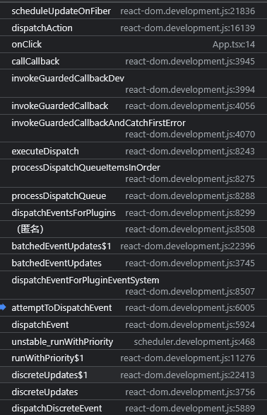
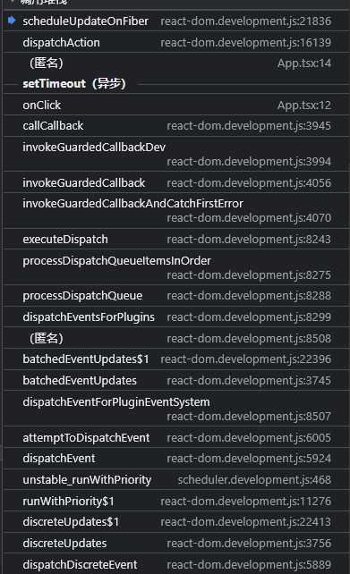

> setState 是同步还是异步执行的

- 如果逻辑进入 flushSyncCallbackQueue(executionContext === NoContext), 则会主动取消调度, 立即进入 fiber 树构造过程. 当执行 setState 下一行代码时, fiber 树已经重新渲染了, 故 setState 体现为同步。
- 正常情况下, 不会取消 schedule 调度. 由于 schedule 调度是通过 MessageChannel 触发(宏任务), 所以体现为异步

```js
const Home = () => {
  const [count, setCount] = useState(0);

  // 打印conut
  console.log("組件渲染了！", count);

  const onClick = () => {
    setTimeout(() => {
      console.log("1111");
      setCount(1);
      console.log("222");
      setCount(2);
      console.log("3333");
    }, 100);
  };

  const onClick = () => {
    console.log("1111");
    setCount(1);
    console.log("222");
    setCount(2);
    console.log("3333");
  };

  return <button onClick={onClick}>按钮{count}</button>;
};
```


