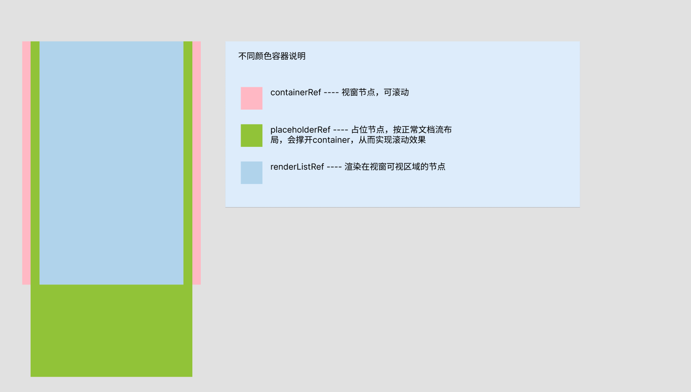

# auto-virtual-list 自动无缝轮播组件实现思路分享

## 背景
    - 监管数据大屏（这个项目已搁置）table组件需要实现自动轮播的功能。
    - 之前使用的开源自动轮播组件，这个组件内部会一次性将请求到的数据全量渲染，并且会创建一个与渲染完成节点内容相同的副本，
      在数据量达到1000左右就会有明显的掉帧现象，很影响用户体验，性能开销太大。   

## 具备能力及优缺点
    - 能力 
        1.虚拟滚动
        2.无缝滚动
        3.自动轮播
        4.分页加载
        5.大数据渲染
    - 优点
        1. 对于空间的占用基本固定。
        2. 极小的计算性能开销。
    - 缺点
        1. 元素高度不一致时，不具备上述功能。

## 虚拟列表结构图示




## 关键变量、dom、阶段简介

```typescript

    // dom节点：
    const containerRef = ref<HTMLElement>()             // 视窗,该节点为虚拟滚动列表的根节点，可以控制其scrollTop属性上下滚动;
    const placeholderRef = ref<HTMLElement>()           // 占位容器，按正常文档流布局。比如列表数据为100条，每个元素高度为30px，placeholderRef.height = 100*30 + 'px';
    const renderListRef = ref<HTMLElement>()            // 在视窗可视区域渲染的容器,控制其translateY属性的范围，定位在视窗的可视区域之上。 translateY = activeIndex * itemHeight

    // 变量
    const totalList = ref<any[]>([])                    // 存储已加载的数据，随着分页请求不断递增
    const renderList  =  ref<any[]>([])                 // renderListRef 节点中渲染的数据

    let _renderNumber:number                            // 可视区域可展示的元素个数  _renderNumber = containerRef.clinetHeight / itemHeight >> 0;
    const activeIndex = (_offest / itemHeight) >> 0     // 视窗顶部的第一个元素的索引，通过对它的赋值以及计算renderList实现滚动效果。
    
    const hasMore = ref<boolean>()                      // 是否还有更多数据

    functionArgment ---> itemHeight                     // 组件入参，元素的高度
    
    let _offest:number                                  // 视窗容器的偏移度   containerRef.scrollTop === offect

    // 阶段1（分页加载阶段，主要处理分页加载逻辑）
    1. 请求分页数据。
    2. 分页数据请求完完毕。

    // 阶段2（所有数据加载完毕，主要处理无缝滚动逻辑）
    1. 第一次触底
    2. 第二次触底

```

## 各个模块的实现

> 分页加载

   - 初始化时会请求一次分页接口，得到totalList;
   - 走的是常规的分页逻辑，触底翻页，将新数据push到totalList上面;
   - 数据加载完完毕后，hasMore = false，后续不再出发分页逻辑;

> 虚拟列表

    - 通过计算得到   placholderRef.style.height =  itemHeight * totalList + 'px';
    - 通过计算得到   _showNumber = ((containerRef.clinetHeiht / itemHeight) >> 0) +2;
    - 截取totalList得到  renderList = totalList.value.slice(0,_showNumber)，r;
    - 触发滚动事件（手动/自动）时通计算滚动条高度，得出当前在视窗顶部展示的数据索引，在这一波实现滚动效果。

> 自动轮播

    - 通过 requestAnimationFrame 回调移动 containerRef.scrollTop 实现自动轮播。
    - 数据加载完毕后，进入无缝滚动逻辑;
  
> 无缝滚动

    1. 第一次触底
        1.追加一屏的数据到 totalList上;
        2.走自动轮播逻辑。

    2. 第二次触底
        1.追加数据后滚动触底时触发
        2.计算视窗的 scrollTop = itemHeight * renderNumber - containerRef.clientHeight 通过这个公式的计算，重置滚动条，实现无缝滚动;