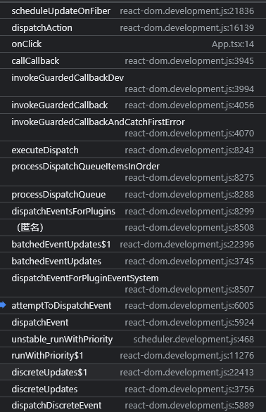
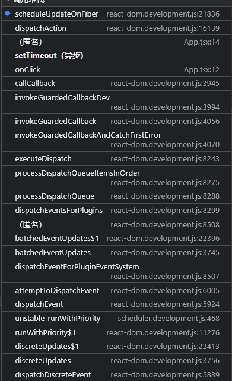

> setState 是同步还是异步执行的

- 如果逻辑进入 flushSyncCallbackQueue(executionContext === NoContext), 则会主动取消调度, 立即进入 fiber 树构造过程. 当执行 setState 下一行代码时, fiber 树已经重新渲染了, 故 setState 体现为同步。
- 正常情况下, 不会取消 schedule 调度. 由于 schedule 调度是通过 MessageChannel 触发(宏任务), 所以体现为异步

```js
const Home = () => {
  const [count, setCount] = useState(0);

  // 打印conut
  console.log("組件渲染了！", count);

  const onClick = () => {
    setTimeout(() => {
      console.log("1111");
      setCount(1);
      console.log("222");
      setCount(2);
      console.log("3333");
    }, 100);
  };

  const onClick = () => {
    console.log("1111");
    setCount(1);
    console.log("222");
    setCount(2);
    console.log("3333");
  };

  return <button onClick={onClick}>按钮{count}</button>;
};
```



> setState 同一个引用/值，为什么不会引起更新

```js
function dispatchAction(fiber, queue, action) {

  // 创建update对象
  var eventTime = requestEventTime();
  var lane = requestUpdateLane(fiber);
  var update = {
    lane: lane,
    action: action,
    eagerReducer: null,
    eagerState: null,
    next: null
  };


  var pending = queue.pending;
  // 将update对象添加到队列的尾部
  if (pending === null) {
    // This is the first update. Create a circular list.
    update.next = update;
  } else {
    update.next = pending.next;
    pending.next = update;
  }
  queue.pending = update;
  var alternate = fiber.alternate;


  if (fiber === currentlyRenderingFiber$1 || alternate !== null && alternate === currentlyRenderingFiber$1) {
    // 这是一个渲染阶段更新。 将其隐藏在一个惰性创建的queue ->更新链表映射中。 在渲染结束后，我们将重新启动并在work-in-progress钩子上应用存储的更新。
    didScheduleRenderPhaseUpdateDuringThisPass = didScheduleRenderPhaseUpdate = true;
  } else {
    if (fiber.lanes === NoLanes && (alternate === null || alternate.lanes === NoLanes)) {
      // 队列目前是空的，这意味着我们可以在进入渲染阶段之前急切地计算下一个状态。 如果新状态与当前状态相同，我们或许能够完全摆脱困境。
      var lastRenderedReducer = queue.lastRenderedReducer;
      if (lastRenderedReducer !== null) {
        var prevDispatcher;
          // 上一次 state 的值
          var currentState = queue.lastRenderedState;
          // 得到最新的状态
          var eagerState = lastRenderedReducer(currentState, action); // Stash the eagerly computed state, and the reducer used to compute
          // it, on the update object. If the reducer hasn't changed by the
          // time we enter the render phase, then the eager state can be used
          // without calling the reducer again.
          update.eagerReducer = lastRenderedReducer;
          update.eagerState = eagerState;

          if (objectIs(eagerState, currentState)) {
            // Fast path. We can bail out without scheduling React to re-render.
            // It's still possible that we'll need to rebase this update later,
            // if the component re-renders for a different reason and by that
            // time the reducer has changed.
            return;
          }
    }
    scheduleUpdateOnFiber(fiber, lane, eventTime);
  }
}
```
