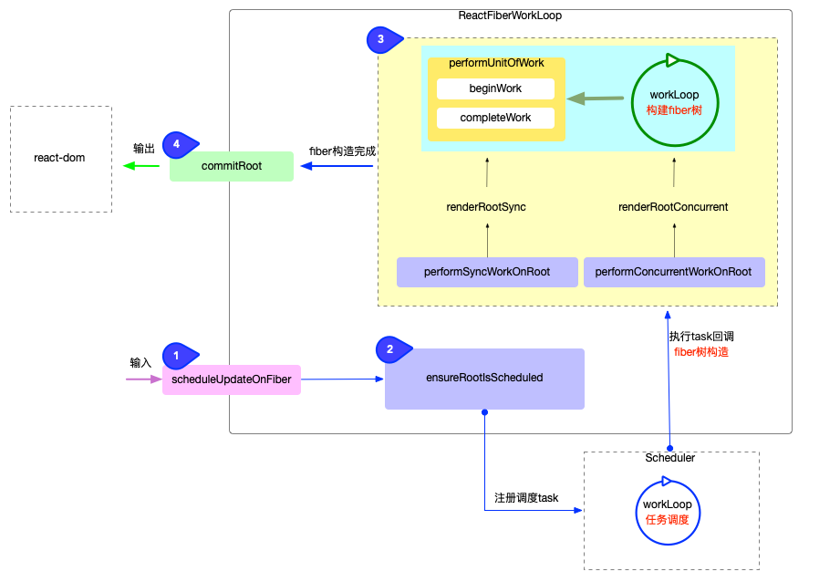

> 主要流程图示以及简介

1. 输入（react 更新的入口）
   - 将每一次更新(如: 新增, 删除, 修改节点之后)视为一次更新需求(目的是要更新 DOM 节点).
2. 注册调度任务
   - 注册调度任务，每个任务都会有对应的优先级，通过各个任务的优先级依次执行任务回调。
3. 执行调度任务(输出)
   - 循环构造 fiber 树, 循环完成之后会构造出最新的 fiber 树。
4. 进入 commit 阶段渲染 dom 节点
   - 把最新的 fiber 树最终渲染到页面上

